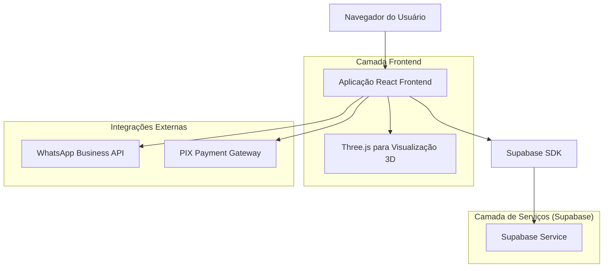
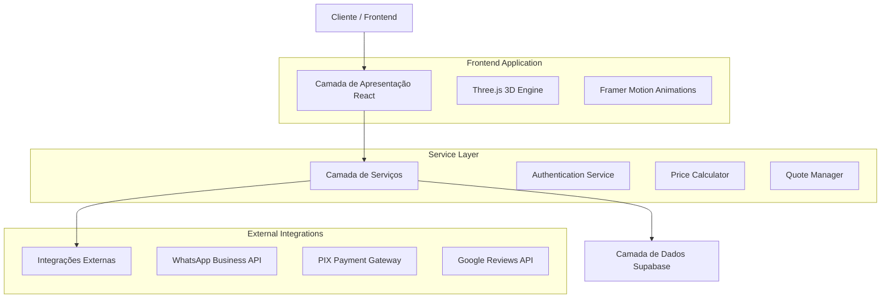
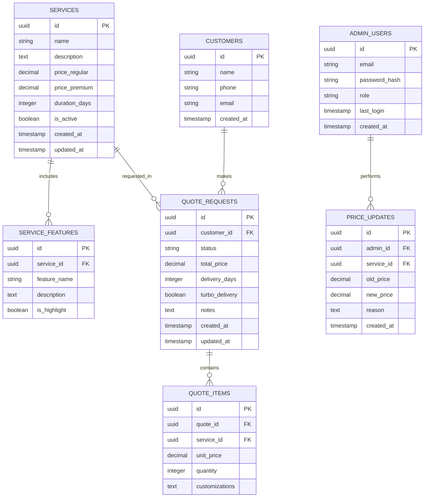

# ATR SNEAKERS - Arquitetura Técnica
## Documento de Arquitetura do Sistema

## 1. Architecture design



## 2. Technology Description

- **Frontend**: React@18 + TypeScript + Tailwind CSS@3 + Vite + Three.js + Framer Motion
- **Backend**: Supabase (Authentication, Database, Storage)
- **Visualização 3D**: Three.js + React Three Fiber
- **Animações**: Framer Motion + CSS Animations
- **Pagamentos**: PIX Gateway Integration
- **Comunicação**: WhatsApp Business API

## 3. Route definitions

| Rota | Propósito |
|------|-----------|
| / | Página inicial com hero section, visualizador 3D e serviços em destaque |
| /servicos | Catálogo completo de serviços com filtros e calculadora de preços |
| /customizador | Interface interativa para customização e simulação 3D de tênis |
| /contato | Formulário de contato e integração com WhatsApp |
| /avaliacoes | Seção de depoimentos e galeria de trabalhos realizados |
| /admin | Painel administrativo para gestão (requer autenticação) |
| /admin/precos | Gestão de preços e configuração de serviços |
| /admin/estatisticas | Dashboard com métricas e relatórios de uso |

## 4. API definitions

### 4.1 Core API

**Gestão de Serviços**
```
GET /api/services
```

Response:
| Nome do Parâmetro | Tipo | Descrição |
|-------------------|------|-----------|
| id | string | Identificador único do serviço |
| name | string | Nome do serviço (Basic Wash, Deep Wash, etc.) |
| description | string | Descrição detalhada do serviço |
| price_regular | number | Preço regular do serviço |
| price_premium | number | Preço premium (se aplicável) |
| duration_days | number | Prazo padrão em dias |
| features | string[] | Lista de características incluídas |

**Calculadora de Preços**
```
POST /api/calculate-price
```

Request:
| Nome do Parâmetro | Tipo | Obrigatório | Descrição |
|-------------------|------|-------------|-----------|
| service_id | string | true | ID do serviço principal |
| additional_services | string[] | false | IDs de serviços adicionais |
| turbo_delivery | boolean | false | Opção de entrega em 48h (+R$30) |
| shoe_type | string | true | Tipo de tênis para cálculo específico |

Response:
| Nome do Parâmetro | Tipo | Descrição |
|-------------------|------|-----------|
| total_price | number | Preço total calculado |
| delivery_days | number | Prazo de entrega estimado |
| breakdown | object | Detalhamento dos custos |

**Solicitação de Orçamento**
```
POST /api/quote-request
```

Request:
| Nome do Parâmetro | Tipo | Obrigatório | Descrição |
|-------------------|------|-------------|-----------|
| customer_name | string | true | Nome do cliente |
| customer_phone | string | true | Telefone para WhatsApp |
| service_details | object | true | Detalhes do serviço solicitado |
| shoe_images | string[] | false | URLs das imagens dos tênis |

Exemplo:
```json
{
  "customer_name": "João Silva",
  "customer_phone": "11999999999",
  "service_details": {
    "service_id": "ultimate_wash",
    "additional_services": ["impermeabilization"],
    "turbo_delivery": true
  },
  "shoe_images": ["url1.jpg", "url2.jpg"]
}
```

## 5. Server architecture diagram



## 6. Data model

### 6.1 Data model definition



### 6.2 Data Definition Language

**Tabela de Serviços (services)**
```sql
-- Criar tabela de serviços
CREATE TABLE services (
    id UUID PRIMARY KEY DEFAULT gen_random_uuid(),
    name VARCHAR(100) NOT NULL,
    description TEXT,
    price_regular DECIMAL(10,2) NOT NULL,
    price_premium DECIMAL(10,2),
    duration_days INTEGER DEFAULT 7,
    is_active BOOLEAN DEFAULT true,
    created_at TIMESTAMP WITH TIME ZONE DEFAULT NOW(),
    updated_at TIMESTAMP WITH TIME ZONE DEFAULT NOW()
);

-- Criar índices
CREATE INDEX idx_services_active ON services(is_active);
CREATE INDEX idx_services_price ON services(price_regular);

-- Inserir dados iniciais
INSERT INTO services (name, description, price_regular, price_premium, duration_days) VALUES
('Basic Wash', 'Lavagem externa completa + neutralizador de odores', 69.90, 89.90, 7),
('Deep Wash', 'Lavagem completa + higienização interna profunda', 99.90, NULL, 7),
('Ultimate Wash', 'Lavagem completa + impermeabilização premium', 109.90, 149.90, 7);
```

**Tabela de Características dos Serviços (service_features)**
```sql
-- Criar tabela de características
CREATE TABLE service_features (
    id UUID PRIMARY KEY DEFAULT gen_random_uuid(),
    service_id UUID REFERENCES services(id) ON DELETE CASCADE,
    feature_name VARCHAR(100) NOT NULL,
    description TEXT,
    is_highlight BOOLEAN DEFAULT false,
    created_at TIMESTAMP WITH TIME ZONE DEFAULT NOW()
);

-- Criar índices
CREATE INDEX idx_service_features_service_id ON service_features(service_id);
CREATE INDEX idx_service_features_highlight ON service_features(is_highlight);

-- Inserir características iniciais
INSERT INTO service_features (service_id, feature_name, description, is_highlight) 
SELECT s.id, 'Lavagem Externa', 'Limpeza completa da parte externa do tênis', true
FROM services s WHERE s.name = 'Basic Wash';
```

**Tabela de Clientes (customers)**
```sql
-- Criar tabela de clientes
CREATE TABLE customers (
    id UUID PRIMARY KEY DEFAULT gen_random_uuid(),
    name VARCHAR(100) NOT NULL,
    phone VARCHAR(20) NOT NULL,
    email VARCHAR(255),
    created_at TIMESTAMP WITH TIME ZONE DEFAULT NOW()
);

-- Criar índices
CREATE INDEX idx_customers_phone ON customers(phone);
CREATE INDEX idx_customers_email ON customers(email);
```

**Tabela de Solicitações de Orçamento (quote_requests)**
```sql
-- Criar tabela de orçamentos
CREATE TABLE quote_requests (
    id UUID PRIMARY KEY DEFAULT gen_random_uuid(),
    customer_id UUID REFERENCES customers(id),
    status VARCHAR(20) DEFAULT 'pending' CHECK (status IN ('pending', 'sent', 'accepted', 'completed', 'cancelled')),
    total_price DECIMAL(10,2),
    delivery_days INTEGER DEFAULT 7,
    turbo_delivery BOOLEAN DEFAULT false,
    notes TEXT,
    created_at TIMESTAMP WITH TIME ZONE DEFAULT NOW(),
    updated_at TIMESTAMP WITH TIME ZONE DEFAULT NOW()
);

-- Criar índices
CREATE INDEX idx_quote_requests_customer_id ON quote_requests(customer_id);
CREATE INDEX idx_quote_requests_status ON quote_requests(status);
CREATE INDEX idx_quote_requests_created_at ON quote_requests(created_at DESC);
```

**Configurações de Permissões Supabase**
```sql
-- Permitir acesso público de leitura aos serviços
GRANT SELECT ON services TO anon;
GRANT SELECT ON service_features TO anon;

-- Permitir acesso completo para usuários autenticados
GRANT ALL PRIVILEGES ON services TO authenticated;
GRANT ALL PRIVILEGES ON service_features TO authenticated;
GRANT ALL PRIVILEGES ON customers TO authenticated;
GRANT ALL PRIVILEGES ON quote_requests TO authenticated;

-- Políticas de segurança (RLS)
ALTER TABLE services ENABLE ROW LEVEL SECURITY;
ALTER TABLE quote_requests ENABLE ROW LEVEL SECURITY;

-- Política para visualização pública de serviços ativos
CREATE POLICY "Serviços ativos são públicos" ON services
    FOR SELECT USING (is_active = true);

-- Política para orçamentos (apenas o próprio cliente ou admin)
CREATE POLICY "Clientes veem seus próprios orçamentos" ON quote_requests
    FOR ALL USING (auth.uid() = customer_id OR auth.jwt() ->> 'role' = 'admin');
```