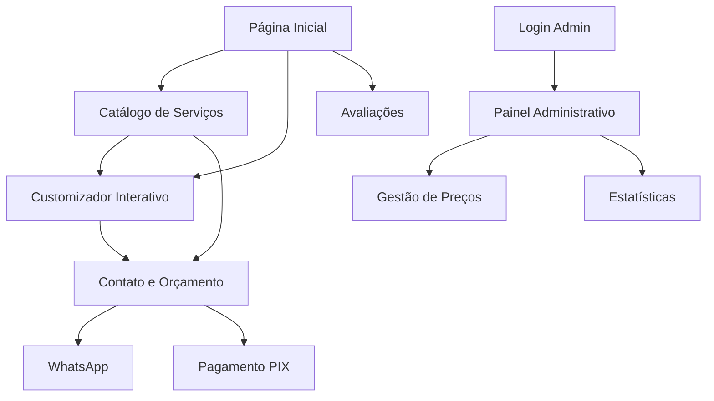

# ATR SNEAKERS - Catálogo Virtual Interativo
## Documento de Requisitos de Produto (PRD)

## 1. Product Overview

A ATR SNEAKERS é uma plataforma digital premium especializada em serviços de limpeza e restauração de tênis, oferecendo uma experiência interativa e visualmente impactante para clientes que buscam cuidados profissionais para seus calçados.

O sistema resolve a necessidade de visualização prévia dos serviços, permitindo que clientes vejam o potencial de restauração antes da contratação, enquanto oferece uma interface moderna e intuitiva para navegação e contratação de serviços.

O produto visa estabelecer a ATR como referência no mercado premium de cuidados com calçados, proporcionando uma experiência digital diferenciada que reflete a qualidade dos serviços oferecidos.

## 2. Core Features

### 2.1 User Roles

| Papel | Método de Registro | Permissões Principais |
|-------|-------------------|----------------------|
| Cliente | Acesso direto sem registro obrigatório | Visualizar serviços, customizar produtos, solicitar orçamentos via WhatsApp |
| Administrador | Login com credenciais específicas | Gerenciar preços, conteúdos, visualizar estatísticas, configurar sistema |

### 2.2 Feature Module

O catálogo da ATR SNEAKERS consiste nas seguintes páginas principais:

1. **Página Inicial**: seção hero com logo, navegação principal, visualizador 3D de tênis, serviços em destaque
2. **Catálogo de Serviços**: lista completa de serviços, filtros por tipo/preço, comparador de antes/depois, calculadora de preços
3. **Customizador Interativo**: visualizador 3D, seletor de cores/modelos, simulação de resultados, estimativa de preços
4. **Contato e Orçamento**: formulário de contato, integração WhatsApp, opções de pagamento, agendamento
5. **Avaliações**: depoimentos de clientes, integração Google/Instagram, galeria de trabalhos realizados
6. **Painel Administrativo**: gestão de preços, configuração de serviços, estatísticas de uso, gerenciamento de conteúdo

### 2.3 Page Details

| Nome da Página | Nome do Módulo | Descrição da Funcionalidade |
|----------------|----------------|----------------------------|
| Página Inicial | Seção Hero | Exibir logo ATR em posição estratégica, animação de fundo com bolhas translúcidas, navegação principal flutuante |
| Página Inicial | Visualizador 3D Principal | Apresentar modelo 3D interativo de tênis, rotação 360°, zoom, transição antes/depois |
| Página Inicial | Serviços em Destaque | Mostrar os 3 principais serviços com preços, botões de ação rápida para WhatsApp |
| Catálogo de Serviços | Lista de Serviços | Exibir Basic Wash (R$69,90/R$89,90), Deep Wash (R$99,90), Ultimate Wash (R$109,90/R$149,90) com descrições detalhadas |
| Catálogo de Serviços | Filtros e Busca | Filtrar por tipo de serviço, faixa de preço, prazo de entrega, busca por palavra-chave |
| Catálogo de Serviços | Calculadora de Preços | Calcular preço total com serviços adicionais, opção Turbo (+R$30), exibir prazo estimado |
| Customizador Interativo | Visualizador 3D Avançado | Permitir rotação, zoom, mudança de ângulos, aplicação de texturas, simulação de limpeza |
| Customizador Interativo | Seletor de Modelos | Escolher entre diferentes tipos de tênis, aplicar cores personalizadas, visualizar resultados |
| Customizador Interativo | Simulação Antes/Depois | Mostrar estado atual vs resultado esperado, animação de transição, comparação lado a lado |
| Contato e Orçamento | Formulário de Contato | Coletar dados do cliente, tipo de serviço desejado, upload de fotos do tênis |
| Contato e Orçamento | Integração WhatsApp | Botão de contato direto, envio automático de informações do orçamento, chat em tempo real |
| Contato e Orçamento | Opções de Pagamento | Exibir métodos disponíveis incluindo PIX, calcular valores finais, gerar links de pagamento |
| Avaliações | Depoimentos de Clientes | Mostrar avaliações do Google e Instagram, sistema de estrelas, fotos de trabalhos |
| Avaliações | Galeria de Trabalhos | Exibir antes/depois de trabalhos reais, filtros por tipo de serviço, zoom em imagens |
| Painel Administrativo | Gestão de Preços | Editar preços de serviços, configurar promoções, definir prazos, ativar/desativar serviços |
| Painel Administrativo | Estatísticas | Visualizar métricas de uso, serviços mais solicitados, conversão de leads, relatórios |

## 3. Core Process

**Fluxo do Cliente:**
O cliente acessa a página inicial e visualiza o modelo 3D interativo dos tênis. Navega pelo catálogo de serviços para conhecer as opções disponíveis (Basic, Deep, Ultimate Wash). Utiliza o customizador para simular o resultado do serviço em seu tênis específico. Solicita orçamento através do formulário ou WhatsApp. Confirma o serviço e escolhe forma de pagamento. Acompanha o progresso através de atualizações via WhatsApp.

**Fluxo do Administrador:**
O administrador acessa o painel através de login seguro. Gerencia preços e configurações dos serviços. Monitora estatísticas de uso e conversão. Atualiza conteúdos e promoções. Responde solicitações de orçamento através da integração WhatsApp.

## 4. User Interface Design

### 4.1 Design Style

**Cores Principais:**
- Azul-claro: #4DD0E1 (elementos interativos, botões primários)
- Azul-escuro: #004D62 (textos principais, navegação)
- Branco: #FFFFFF (fundo principal, cards)
- Cinza gelo: #F6F8FB (fundo secundário, seções)
- Laranja vibrante: #FF9800 (call-to-actions, destaques)

**Tipografia:**
- Fonte principal: Inter ou Poppins (sans-serif moderna)
- Tamanhos: H1 (32px), H2 (24px), H3 (20px), Body (16px), Small (14px)

**Estilo de Botões:**
- Bordas arredondadas (border-radius: 12px)
- Efeitos de hover com transições suaves
- Sombras sutis para profundidade

**Layout:**
- Design baseado em cards com cantos arredondados
- Navegação superior fixa e flutuante
- Grid responsivo com breakpoints bem definidos
- Animações suaves e micro-interações

**Ícones e Emojis:**
- Ícones minimalistas e consistentes
- Emojis relacionados a limpeza: 🧽, ✨, 👟, 💧
- Estilo outline para ícones de interface

### 4.2 Page Design Overview

| Nome da Página | Nome do Módulo | Elementos de UI |
|----------------|----------------|-----------------|
| Página Inicial | Seção Hero | Fundo gradiente azul-claro para azul-escuro, logo ATR centralizado, animação de bolhas translúcidas com opacity 0.3, tipografia Inter Bold 32px |
| Página Inicial | Visualizador 3D | Container branco com sombra sutil, modelo 3D centralizado, controles de rotação em laranja, botões arredondados 12px |
| Catálogo de Serviços | Cards de Serviços | Cards brancos com border-radius 16px, preços em laranja vibrante, descrições em azul-escuro, botões CTA em azul-claro |
| Customizador Interativo | Interface 3D | Painel lateral cinza gelo, seletores de cor em formato circular, preview em tempo real, animações de transição 300ms |
| Contato e Orçamento | Formulário | Campos com border-radius 8px, labels em azul-escuro, botão WhatsApp em verde (#25D366), validação visual |
| Painel Administrativo | Dashboard | Layout em grid, cards de métricas com ícones, gráficos em tons de azul, tabelas com zebra striping |

### 4.3 Responsiveness

O produto é desenvolvido com abordagem mobile-first, garantindo experiência otimizada em smartphones, tablets e desktops. Inclui otimização para interações touch com botões de tamanho adequado (mínimo 44px), navegação por gestos no visualizador 3D, e adaptação automática do layout conforme o tamanho da tela. Breakpoints principais: 320px (mobile), 768px (tablet), 1024px (desktop), 1440px (large desktop).